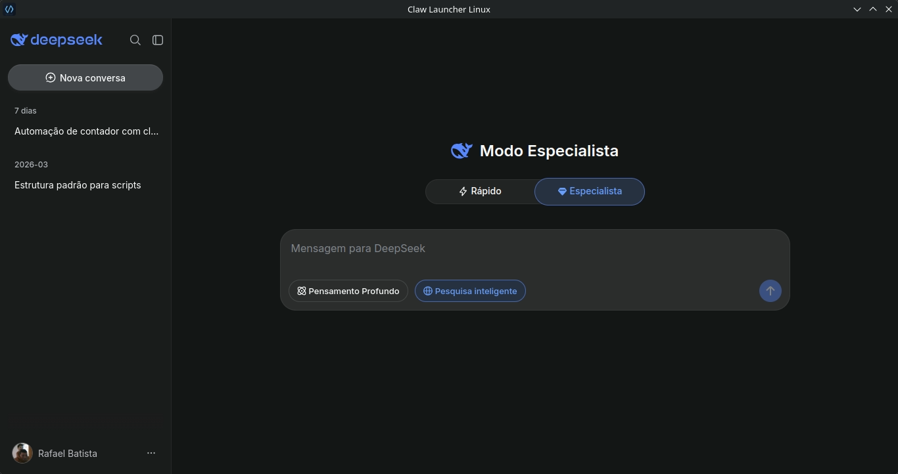
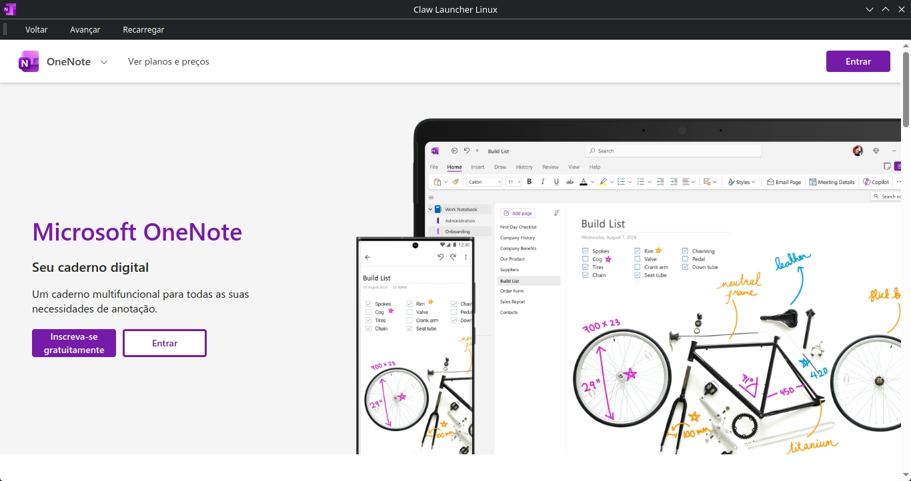

# 🌐 OneNote — Guia Completo

> **Versão:** 1.0.2 | **Tecnologia:** Python + PyQt6 + UV Workspaces | **Última atualização:** 2026/05/21




**OneNote** é o aplicativo principal do launcher nativo para Linux. Ele usa **PyQt6 WebEngine** para transformar o OneNote em um aplicativo integrado ao seu desktop (KDE, GNOME, XFCE, etc).

---

## ⚡ Modern Stack: UV & Workspaces

O projeto agora utiliza o **[UV](https://github.com/astral-sh/uv)**, o gerenciador de pacotes Python mais rápido do mercado.

### Benefícios:
* **Instalação Instantânea:** O `uv` sincroniza dependências em milissegundos.
* **Monorepo (Workspace):** A raiz gerencia as dependências. Cada nova instância (`instance_*`) é automaticamente reconhecida como membro do workspace via globbing.
* **Isolamento de Sistema Imutável:** Perfeito para **Fedora Kinoite/Silverblue**, pois não interfere no Python do sistema.

### Estrutura do Projeto:
```text
ClawProject/
├── pyproject.toml        # Configuração do Workspace (Raiz)
├── uv.lock               # Lockfile único (versões consistentes)
├── instance_Claw_XXX/    # Cada app criado é um "membro" do workspace
│   ├── pyproject.toml    # Configuração local da instância
│   └── ...
└── Claw_Launcher_Linux.py
```

---

## 🚀 Novo fluxo de uso

1. **Sincronizar:** `uv sync`
2. **Gerenciar:** `./create_app.sh`

O projeto agora é centralizado no script `create_app.sh`. Ele cuida do fluxo de instâncias do launcher:

1. instalar app pré-configurado a partir de `ICON/Links.txt`
2. instalar nova instância
3. desinstalar instância
4. listar instâncias
5. instalar app principal (base)
6. desinstalar app principal (base)
7. limpar caches

### Iniciar o menu
```bash
chmod +x *.sh
./create_app.sh
```

---

## 🛠️ Como funciona o menu

No menu interativo do `create_app.sh`, use:

- `1` para **instalar app pré-configurado (Links.txt)**
- `2` para **instalar nova instância**
- `3` para **desinstalar instância**
- `4` para **listar tudo e ver status**
- `5` para **instalar OneNote (app principal)**
- `6` para **desinstalar OneNote (app principal)**
- `7` para **limpar cache individual** (OneNote ou instância criada)
- `0` para sair

---

## 🛠️ Comandos diretos

| Função | Comando |
| :--- | :--- |
| Menu interativo | `./create_app.sh` |
| Instalar app pré-configurado | `./create_app.sh preconfigured` (ou `./create_app.sh create-preconfigured`) |
| Instalar nova instância | `./create_app.sh install-new "Nome" "URL"` (ou `./create_app.sh create "Nome" "URL"` para compatibilidade) |
| Instalar instância existente | `./create_app.sh install "Nome"` |
| Desinstalar instância | `./create_app.sh uninstall "Nome"` |
| Listar instâncias | `./create_app.sh list` |

---

## 🌐 Atalhos e preferência de links

* O menu de criação pré-configurada exibe todos os links registrados em `ICON/Links.txt`.
* Cada link pode ser escolhido e criado como app automaticamente, sem etapas extras.
* Se você digitar ou colar uma URL nova durante a criação manual, ela será salva automaticamente em `ICON/Links.txt`.
* O script lista ícones disponíveis em `ICON/` e permite escolher o ícone por número ou por nome de arquivo.

---

## 🕹️ Funcionalidades do Launcher

* ✅ **Suporte Multi-idioma**: escolha entre Português e Inglês.
* ✅ **Navegação**: botões de Voltar, Avançar, Recarregar e barra de endereço.
* ✅ **Persistência**: o idioma e a última página são salvos na configuração do usuário.
* ✅ **Isolamento**: cada instância tem cache, cookies e sessão próprios.
* ✅ **Atalhos**: teclado padrão para navegação e recarregamento.

---

## 🆘 Suporte e erros comuns

Se o app abrir e fechar, provavelmente falta dependência do Qt WebEngine.

### Verifique dependências

* **Ubuntu/Debian/Mint/Pop!_OS:**
```bash
sudo apt install python3-pyqt6.qtwebengine
```
* **Fedora:**
```bash
sudo dnf install python3-qt6-webengine
```
* **Arch Linux/Manjaro:**
```bash
sudo pacman -S python-pyqt6-webengine
```

---

## 🗑️ Desinstalação completa

Para remover o app base e instâncias criadas:

1. Execute `./create_app.sh`
2. Use a opção `5` para desinstalar o app principal (base)
3. Execute `./manage_instances.sh uninstall-all` para remover todas as instâncias

---

**Autor:** Rafael Batista | **Licença:** MIT
